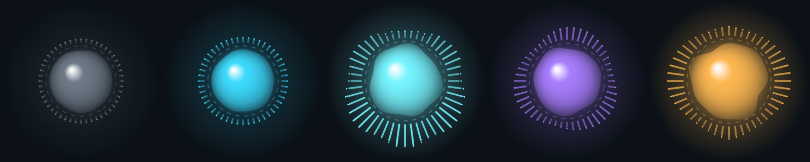

# Джарвис — голосовой помощник для Windows 11


[](https://github.com/softlyfear/jarvis/actions/workflows/windows.yml)

Говорите «Джарвис», после отклика — команду: «открой телеграм», «запусти доту», «громкость пятьдесят», «удали вчерашний скриншот». Отвечает записанным голосом Джарвиса из русского дубляжа, а на свободные вопросы — клоном того же голоса.

Форк [Priler/jarvis](https://github.com/Priler/jarvis): ядро на Rust (Tauri) от Abraham Tugalov, доработанное для повседневного использования.

**Скачать:** [`JarvisSetup.exe`](https://github.com/softlyfear/jarvis/releases/download/latest/JarvisSetup.exe) — установщик в одну кнопку ([все файлы](https://github.com/softlyfear/jarvis/releases/tag/latest)) · **Установка и настройка:** [docs/INSTALL-RU.md](docs/INSTALL-RU.md)

## Быстрый старт

1. Скачайте [`JarvisSetup.exe`](https://github.com/softlyfear/jarvis/releases/download/latest/JarvisSetup.exe) и запустите. Windows может предупредить «Система Windows защитила ваш компьютер» → **Подробнее → Выполнить в любом случае** (программа не подписана).
2. В установщике оставьте папку `C:\Jarvis`. Галочка «Точное распознавание и голос Джарвиса» ставит всё под вашу видеокарту — NVIDIA, AMD или Intel, установщик определит её сам.
3. Ключ нейросети можно пропустить и добавить позже. Из России без VPN — ключ Polza AI, с VPN — Kilo (как получить — ниже).
4. Скажите «Джарвис», дождитесь отклика и дайте команду: «открой телеграм», «громкость тридцать».

## Нейросеть: Polza AI или Kilo

Всё, чего нет во встроенных командах (разговор, вопросы, «удали вчерашний скриншот»), понимает нейросеть. Модели одни и те же — Gemini 3.5 Flash-Lite, затем Gemini 3.5 Flash и DeepSeek V4 Flash, — подключаются через один из двух шлюзов:

- **[Polza AI](https://polza.ai)** — работает из России **без VPN**, оплата рублями (от 100 ₽, СБП или карта), просьба стоит несколько копеек. Ключ начинается с `sk-`.
- **[Kilo](https://kilo.ai)** — из России **только через VPN** (иначе отвечает 403). Без ключа даёт бесплатные модели (до 200 запросов в час: Nemotron 3 Ultra, Ling 3.0 Flash и другие), с ключом `eyJ…` — платные, около четырёх центов за полсотни просьб.

Ключ вставляется в установщике на шаге «Нейросеть» или позже: окно Джарвиса → **Настройки → Джарвис → Нейросеть** → «Сохранить». Шлюз определяется по ключу сам. Выбранный шлюз отвечает первым, второй (если у него есть ключ) и бесплатные модели Kilo — запасные: кончатся деньги или шлюз недоступен — Джарвис перейдёт дальше сам.

- Ключ Polza AI: <https://polza.ai> → личный кабинет → ключи API; там же пополнение.
- Ключ Kilo: <https://app.kilo.ai> → **Your Profile** (личный аккаунт, не организация) → внизу страницы. Он один на аккаунт.

Переключатель **«Только бесплатные модели»** не тратит деньги, даже если ключ есть. Ключ — как пароль, не выкладывайте его; в собранных логах он скрыт.

## Возможности

| | Без интернета | Чем сделано |
|---|---|---|
| Открыть и закрыть любую программу | ✔ | меню «Пуск», ярлыки, псевдонимы из настроек; русские названия сопоставляются с английскими |
| Запустить игру по названию или прозвищу | ✔ | библиотеки Steam находятся автоматически, `steam://rungameid` |
| Громкость, пауза, треки | ✔ | медиаклавиши Windows |
| Папки, поиск и удаление файлов | ✔ | только в разрешённых папках и только в Корзину |
| Скриншот, свернуть окна, блокировка, сон, выключение | ✔ | опасное переспрашивает «да или нет» |
| Окна, вкладки, копировать и вставить, «напечатай …» | ✔ | клавиши и ввод текста в активное окно |
| Время, дата, таймеры, будильник, напоминания, секундомер | ✔ | локально, переживают перезапуск Джарвиса |
| Разговор, сложные просьбы, цепочки действий | — | Gemini и DeepSeek через Polza AI или Kilo; нейросеть сама вызывает действия ПК и помнит разговор |
| Точное распознавание речи | ✔ | Whisper `large-v3-turbo`: на NVIDIA — faster-whisper, на AMD и Intel — whisper.cpp (Vulkan); без сервера — Vosk |
| Ответы голосом Джарвиса | ✔ | XTTS-v2: на NVIDIA (CUDA) и AMD RX 5000+ (ROCm) — на видеокарте, иначе на процессоре; без сервера — голос Windows |
| Шар, реагирующий на голос | ✔ | окно программы: эквалайзер по спектру микрофона, цвет по состоянию |



## Как устроено

```
микрофон ──► Vosk: слово «Джарвис» и конец фразы
                 │
                 ▼
           Whisper (голосовой сервер) ──нет сервера──► текст Vosk
                 │
                 ▼
     команда из resources/commands ── найдена ──► нативное действие ──► фраза Джарвиса
                 │                                   (не нашла объект)
                 └── не найдена ──────────────┐            │
                                              ▼            ▼
                                  нейросеть (tools = те же действия)
                                              │
                                              ▼
                               ответ ──► клон голоса / голос Windows
```

- **Команды** — паки `resources/commands/*/command.toml`. Фразы обучают классификатор намерений, `type = "action"` вызывает нативное действие из `crates/jarvis-core/src/actions/`.
- **Нейросеть** (`llm.rs`) — шлюзы Polza AI и Kilo через OpenAI-совместимый API (подходит и любой другой такой провайдер). Сначала выбранный шлюз (`[[llm.providers]] name = "polza"` или `"kilo"`), затем второй, затем бесплатные модели Kilo (`KILO_FREE_MODELS`); модель, ответившая «перегружена» или «лимит», пропускается, ключ без денег (402) отдыхает час, шлюз, запретивший (403) все модели подряд, — две минуты.
- **Голосовой сервер** (`tools/voice-server`) — Python: faster-whisper или whisper.cpp + coqui-tts. Джарвис запускает его в фоне сам и работает без него, если сервер не установлен.
- **Видеокарта** (`tools/voice-server/gpu.py`) — установщик определяет её через WMI и OpenCL и выбирает профиль: `cuda` (NVIDIA), `rocm` (AMD с официальным PyTorch ROCm для Windows: RX 5000–9000, Ryzen AI), `vulkan` (другие AMD и Intel), `cpu`. Если несколько видеокарт, берётся дискретная. Если ROCm или Vulkan не запустились, сервер переходит на процессор.
- **Настройки пользователя** — `%APPDATA%\com.priler.jarvis\assistant.toml`: ключи, псевдонимы программ, игр и папок, разрешённые папки, голос. Шаблон с комментариями — [`assistant.default.toml`](crates/jarvis-core/assets/assistant.default.toml).

## Требования

| | Минимум | Для Whisper и клона голоса |
|---|---|---|
| ОС | Windows 10/11 x64 | — |
| Видеокарта | не нужна | NVIDIA, AMD или Intel, от 6 ГБ видеопамяти (Whisper ~1,5 ГБ + голос 2–4 ГБ, оценка). Голос на видеокарте — NVIDIA или AMD RX 5000+ со свежим драйвером Adrenalin; на остальных — на процессоре |
| Место | ~400 МБ | ещё 3–7 ГБ: Python-окружение и модели, зависит от видеокарты |
| Интернет | не нужен | только для нейросети и первой загрузки моделей |

## Сборка из исходников

Проверенный путь — GitHub Actions ([`.github/workflows/windows.yml`](.github/workflows/windows.yml)), шаг `Package` собирает архив. Те же шаги локально на Windows:

```powershell
# Rust (MSVC), Node.js 22
cd frontend; npm ci; npx vite build; cd ..
cargo build --release -p jarvis-app     # голосовой цикл и трей
cargo build --release -p jarvis-gui     # окно настроек (отдельной командой, см. ниже)
```

Затем разложите рядом с exe ресурсы и DLL, как в шаге `Package` workflow.

Пакеты собираются **раздельно**: при общей сборке cargo объединяет features `jarvis-core`, и окно настроек начинает требовать библиотеку Vosk.

Тесты работают и на Linux:

```bash
cargo test -p jarvis-core --no-default-features --features reqwest --lib
cd tools/voice-server && python -m pytest -q      # нужны только numpy и pytest
```

## Структура

| Путь | Что |
|---|---|
| `crates/jarvis-app` | главный цикл: слово активации → распознавание → команда; трей |
| `crates/jarvis-core` | ядро: STT, команды, действия, нейросеть, голос, настройки |
| `crates/jarvis-gui`, `frontend` | окно настроек (Tauri 2 + Svelte) |
| `resources/commands` | голосовые команды |
| `resources/sound/voices` | записанные фразы Джарвиса |
| `resources/vosk` | модели Vosk |
| `tools/voice-server` | Whisper + клон голоса, определение видеокарты (`gpu.py`) |
| `installer` | установщик (Inno Setup) и первичная настройка |
| `docs/INSTALL-RU.md` | инструкция для пользователя |

## Отличия от upstream

- Паки команд переписаны с AutoHotkey и старого YAML на нативные действия (в upstream большая часть паков не загружалась). Исправлен пак погоды.
- Добавлены: нейросетевой фолбэк с инструментами, голосовое подтверждение опасных действий, Whisper, озвучка произвольного текста, автозапуск голосового сервера, поддержка видеокарт NVIDIA, AMD и Intel с автоопределением, шар-визуализатор, установщик, сборка и выпуск через GitHub Actions.

## Лицензия и авторы

Исходный проект — © Abraham Tugalov ([Priler](https://github.com/Priler)), [CC BY-NC-SA 4.0](https://creativecommons.org/licenses/by-nc-sa/4.0/): только некоммерческое использование, с указанием автора и под той же лицензией. Доработки форка распространяются на тех же условиях. Подробности — в [LICENSE.txt](LICENSE.txt).

Используемые модели: [Vosk](https://alphacephei.com/vosk/), [Whisper](https://github.com/openai/whisper) через [faster-whisper](https://github.com/SYSTRAN/faster-whisper) и [whisper.cpp](https://github.com/ggml-org/whisper.cpp) (MIT), [XTTS-v2](https://huggingface.co/coqui/XTTS-v2) (Coqui Public Model License, некоммерческая).
